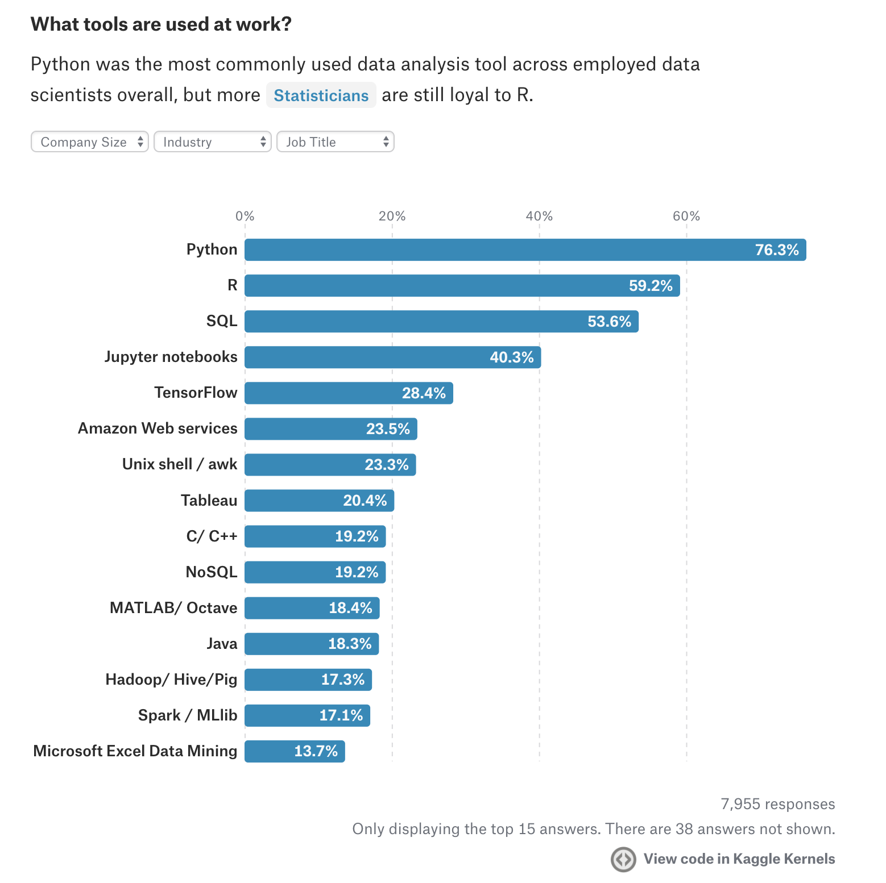
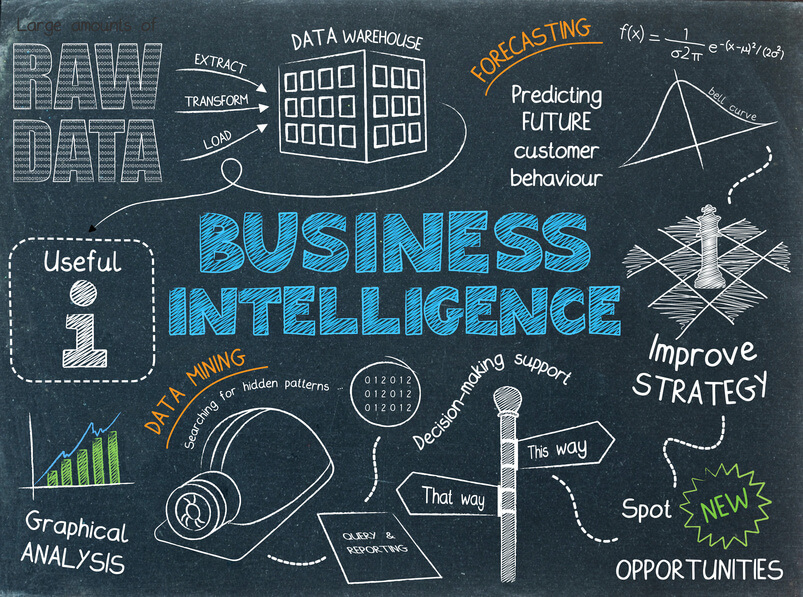

# Lecture #5

_7 November 2017_

## More resources on data analysis?

Right now, there is a sale on Udemy. Two proven corses worth the money are:

1. [Python for Data Science and Machine Learning Bootcamp](https://www.udemy.com/python-for-data-science-and-machine-learning-bootcamp/learn/v4/overview)
2. [Apache Spark 2.0 with Scala - Hands On with Big Data!](https://www.udemy.com/apache-spark-with-scala-hands-on-with-big-data/learn/v4/overview)

Suggestions are inspired also by [Kaggle's State of Data Science & Machine Learning Survey 2017](https://www.kaggle.com/surveys/2017), e.g.:

## Let's review your assignments...

Nice work, by the way!

## Back to BI in general...

Source: [www.dtm.ca](https://www.dtm.ca).

### Let's start with the upper left corner: Raw Data -> Data Warehouse (DWH)

Technically, it could be as simple, as refreshing your source data in a Pivot Table...
But, much more serious solutions could be based on e.g.:

1. Power Query and Power BI
2. Microsoft SQL Server Integration Services
3. Keboola
4. Spark

From a [good article](https://www.red-gate.com/simple-talk/sql/bi/scala-apache-spark-tandem-next-generation-etl-framework/):

> What makes Scala and Apache Spark combination special? Scala gives you the best of functional programming features with immutable data structures whereas Spark offers parallel processing out of the box. This combination can be the foundation of highly reliable and scalable ETL pipelines.
> [...] Scala is a very broad-based language with lots of useful but sometimes complex features. [...] So, you will need to be prepared for some deep learning that can be frustrating at first!

### Preparation for the next lecture

Install Scala and Spark on your computers – [instructions for Windows](https://medium.com/@josemarcialportilla/installing-scala-and-spark-on-windows-249632e6b83b).
